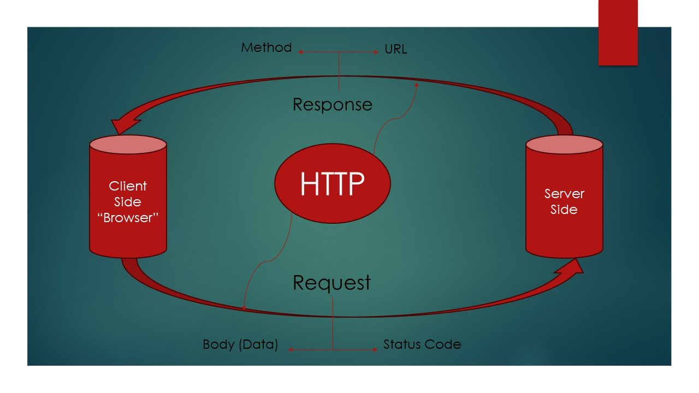

# Movies Library - v1.0.0

**Author Name**: Abdalrhman Aboalsoud

## WRRC

## Overview

The Movies Library project aims to provide a platform for users to explore and access information about various movies. Users can view details such as movie titles, poster images, and brief overviews.

## Getting Started

To build and run this app on your own machine, follow these steps:

1. Clone the repository to your local machine:
git clone "<git@github.com>:abdalrhmanaboalsoud/Movies-Library.git".

2. Navigate to the project directory:
cd Movies-Library

3. Create a new branch called Lab11

5. Create basic file structure (server.js, .gitignore, .eslintrc.json ).

6. Install the required packages for this lab: npm install.

7. Start the server: node server.js

8. Access the application by opening a web browser and navigating to `http://localhost:3002`.

## Project Features

The Movies Library app includes the following features:

- Display movie titles, poster images, and brief overviews.
- Handle HTTP GET requests for home page and favorite page endpoints.
- Implement error handling for server errors (status 500) and page not found errors (status 404).
- Provide clear documentation in the README file for project setup and usage.

## License

This project is licensed under the [MIT License](https://opensource.org/licenses/MIT).

This project utilizes Express.js for server-side development and provides a structured approach for handling HTTP requests and responses. It aims to offer users an intuitive and seamless experience while exploring movie details.
