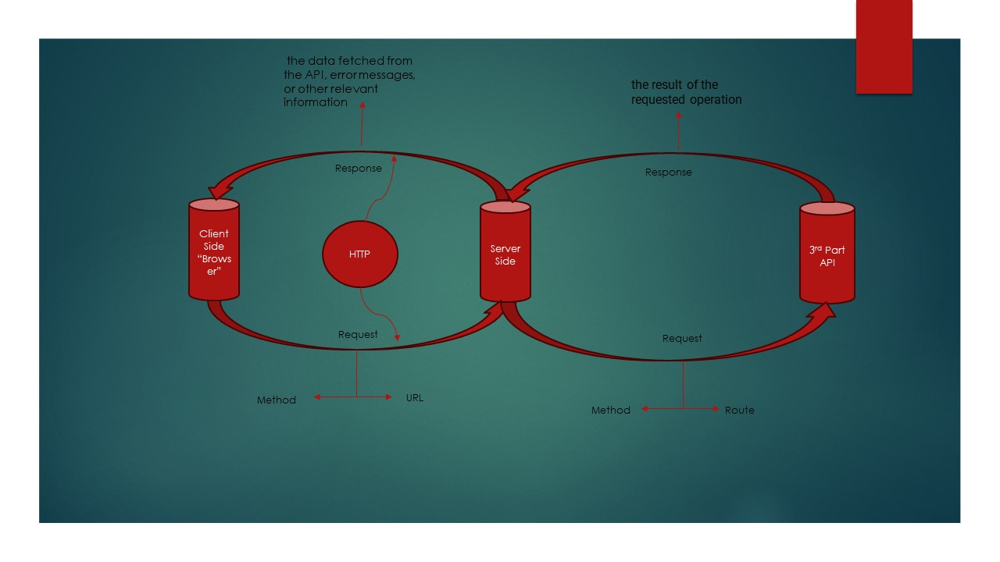
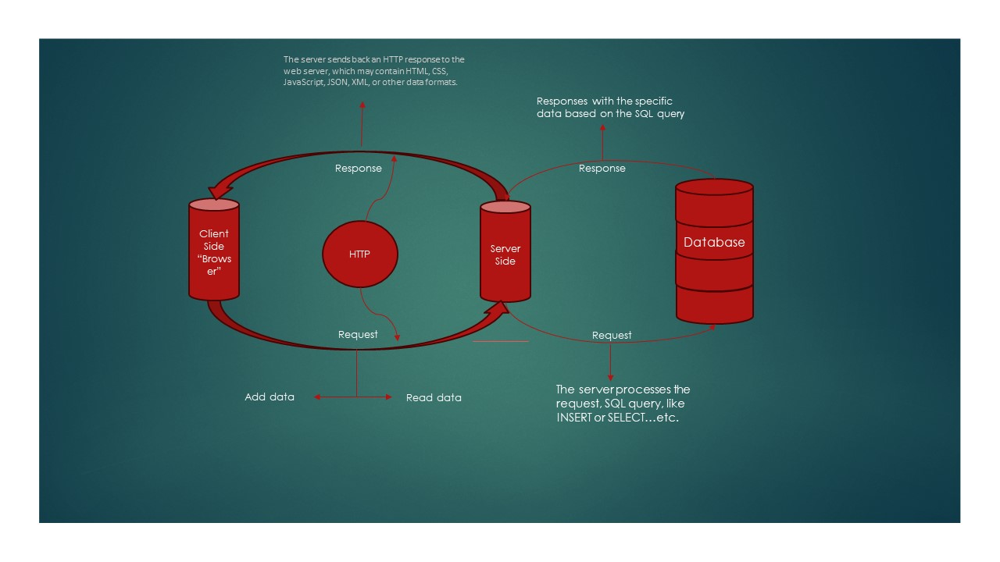

# Movies Library - v1.0.0

**Author Name**: Abdalrhman Aboalsoud

## WRRC

## Overview

The Movies Library project aims to provide a platform for users to explore and access information about various movies. Users can view details such as movie titles, poster images, and brief overviews.

## Getting Started

To build and run this app on your own machine, follow these steps:

1. Clone the repository to your local machine:
git clone "<git@github.com>:abdalrhmanaboalsoud/Movies-Library.git".

2. Navigate to the project directory:
cd Movies-Library

3. Create a new branch called Lab11.

5. Create basic file structure (server.js, .gitignore, .eslintrc.json ).

6. Install the required packages for this lab: npm install.

7. Start the server: node server.js.

8. Access the application by opening a web browser and navigating to `http://localhost:3002`.

## Project Features

The Movies Library app includes the following features:

- Display movie titles, poster images, and brief overviews.
- Handle HTTP GET requests for various endpoints, including favorites, trending movies, trending TV shows, and searching for movies.
- Fetch data from external APIs such as The Movie Database API using Axios.
- Implement error handling middleware to respond to server errors (status 500) and page not found errors (status 404).
- Provide clear documentation in the README file for project setup and usage.

## Changes in Version 2.0.0

- Added new endpoints for fetching trending TV shows, searching for movies, and retrieving TV show genres.
- Implemented constructors to shape data received from external APIs into custom objects.
- Updated error handling middleware to handle additional error scenarios and provide appropriate error messages.
- Refactored code for improved readability and maintainability.
- Updated documentation in the README file to reflect changes and provide clear instructions for project setup and usage.

## Changes in Version 3.0.0

- **Database Integration**: Added PostgreSQL database integration using the `pg` client to store movie data.
- **New Endpoints**: Added new endpoints `/addMovie` and `/getMovie` for adding and retrieving movie data from the database.
- **Body Parsing Middleware**: Implemented body parsing middleware using `body-parser` to parse incoming request bodies in JSON and URL-encoded formats.
- **Database Query Handling**: Implemented functions to handle database queries for adding and retrieving movie data.
- **Connection Handling**: Established a connection to the PostgreSQL database and handled errors using promises.
- **Data Persistence**: Stored movie data in the `movie` table within the `lab13` database.
- **Database Management**: Created the PostgreSQL database `lab13` and the table `movie` using appropriate SQL commands.

## License

This project is licensed under the [MIT License](https://opensource.org/licenses/MIT).

This project utilizes Express.js for server-side development and Axios for making HTTP requests. It aims to offer users an intuitive and seamless experience while exploring movie details.
